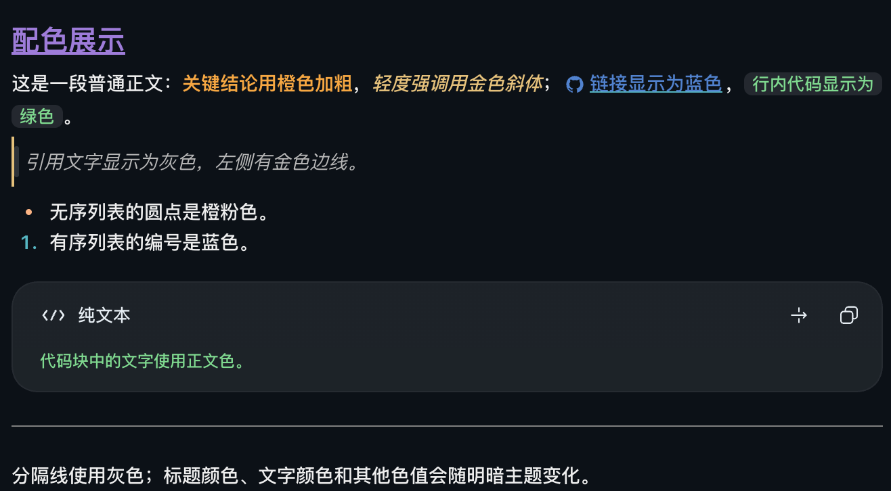
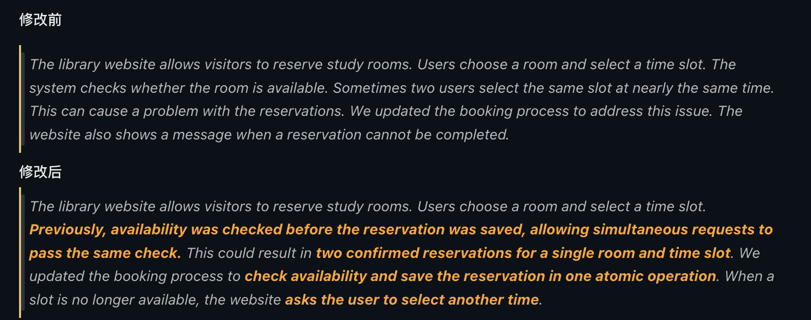

# Codex prose colors

[简体中文](README.md) | **English**

Adds text colors to assistant Markdown replies in the ChatGPT/Codex desktop app for macOS. It injects CSS through the local Chrome DevTools Protocol (CDP) without modifying the app's installation files. Even when a Codex agent runs on a remote Linux host, the styles appear only in the local Mac desktop app where this tool is installed and running.

## First use

Requirements: macOS, `/Applications/ChatGPT.app`, and Node.js 22 or later. Fully quit ChatGPT on your Mac, then run:

```sh
git clone https://github.com/WhoJay0609/codex-prose-colors.git
cd codex-prose-colors
node theme.mjs start
```

On success, the command prints JSON containing `"status":"started"`; open a conversation with an assistant reply to view the effect. This behavior is [defined by the script](theme.mjs), but was not verified in a macOS run during this pass. You can also double-click `activate.command` to start it. Run `node theme.mjs stop` or double-click `restore.command` to stop it and restore the styles. See the [usage guide (Chinese)](docs/usage.md) for full instructions and troubleshooting.

Tested: Node.js 22.22.0 on Linux, running `node --check theme.mjs`; exit code 0 with no output. The screenshots below show effects provided by the user; startup and injection were not retested on macOS during this pass.

Entry point: [theme.mjs](theme.mjs); colors: [opencode-prose.css](opencode-prose.css); reply-format suggestions: [suggested snippet (Chinese)](docs/agents-snippet.md).



In assistant replies in the Codex desktop app, body text keeps its normal color; headings are purple (with an underline on level-one headings), **bold text is orange**, *italic text is gold*, [links are blue](https://example.com), and `inline code is green`. Unordered-list markers are orange-pink, ordered-list numbers are blue, quote text is gray with a gold border, and horizontal rules are gray. Code-block text may also be affected by the app's syntax highlighting. The screenshot shows dark mode; light mode uses a different set of colors. “Highlight” here means text color, not background color. GitHub renders this README with its own styles, so view the color effects in the desktop app with this tool enabled.

<details>
<summary>Expand to copy the Markdown color example</summary>

English equivalent sample (the screenshot may use different text):

````md
# Color preview

Regular body text: **bold key points appear in orange**, *light emphasis appears in gold*; [links appear in blue](https://github.com/WhoJay0609/codex-prose-colors), and `inline code appears in green`.

> Quote text appears in gray, with a gold border on the left.

- Unordered-list bullets are orange-pink.

1. Ordered-list numbers are blue.

```text
Text in code blocks uses the normal body color.
```

---

Horizontal rules are gray; heading, text, and other colors vary with the light or dark theme.
````

</details>

## Before and after

The image uses an original, fictional English library-reservation notice to demonstrate a text revision: unchanged context stays gray, while the revised key phrases appear as bold orange text. This example is for demonstrating colors only; it does not represent the implementation or test results of a real system.



If you want replies to use these Markdown styles based on meaning, copy the [suggested snippet (Chinese)](docs/agents-snippet.md) into `~/.codex/AGENTS.md`. The snippet only affects reply formatting; it does not install or enable this tool.
